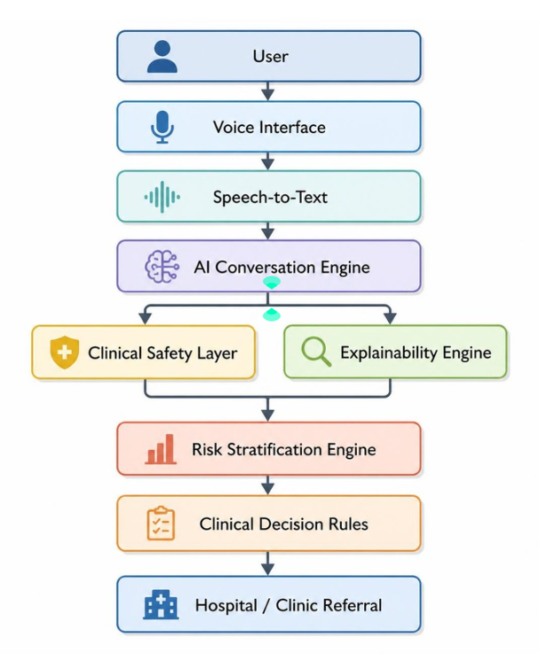

# healthyHER-sti-health-checker
An AI Voice-Based Sexual Transmission Infection (STI) Symptom Checker 


# 🩺 AI Voice-Based STI Symptom Checker

> **Building a safe, explainable, and privacy-first AI assistant to improve access to sexual health information.**

---

## 🌍 Vision

Sexually transmitted infections (STIs) remain a significant public health challenge, yet many individuals delay seeking care due to stigma, embarrassment, language barriers, cost, and uncertainty.

This project explores how **conversational AI** can lower these barriers by providing an accessible, multilingual, and voice-first experience that encourages users to seek appropriate medical care—while recognizing that AI should **support**, not replace, healthcare professionals.

Our long-term vision is to create an AI-powered digital health assistant that improves health equity through responsible and clinically informed AI.

---

## 🎯 Mission

Build an AI assistant that:

- 🎙️ Makes sexual health information more accessible through natural conversation
- 🌏 Supports multilingual and culturally inclusive interactions
- 🩺 Encourages appropriate care-seeking instead of self-diagnosis
- 🛡️ Prioritizes clinical safety and responsible AI principles
- 🔍 Provides transparent and explainable recommendations
- 🔒 Protects user privacy by design

---

# 🚨 The Problem

Millions of people postpone STI testing because of:

- Social stigma
- Embarrassment
- Language barriers
- Financial constraints
- Uncertainty about symptoms
- Fear of judgment

Delays in testing can contribute to untreated infections, poorer health outcomes, and continued transmission.

This project investigates whether conversational AI can serve as an accessible first point of guidance while maintaining strong clinical safeguards.

---

# 💡 Solution

An AI-powered voice assistant that guides users through symptom discussions using structured clinical reasoning before recommending an appropriate next step.

Rather than diagnosing users, the assistant aims to:

- Understand symptoms
- Identify potential risk factors
- Provide understandable explanations
- Recommend suitable healthcare services when necessary
- Encourage timely medical consultation

---

# ✨ Core Features

- ✅ Voice-first conversational interface
- ✅ Multilingual support
- ✅ Explainable AI recommendations
- ✅ Safety-first prompting
- ✅ Clinical escalation pathways
- ✅ Risk stratification
- ✅ Privacy-by-design architecture
- ✅ Responsible AI principles

---

# 🏗️ System Architecture

```text
User
   │
   ▼
🎙️ Voice Input
   │
   ▼
🗣️ Speech-to-Text
   │
   ▼
🤖 Large Language Model (LLM)
   │
   ▼
🛡️ Clinical Safety Layer
   │
   ▼
📚 Clinical Decision Rules
   │
   ▼
📊 Risk Classification
   │
   ▼
🏥 Referral Recommendation
   │
   ▼
Hospital / Clinic
```

---

# 🧠 Responsible AI Principles

Healthcare AI requires more than accuracy—it requires trust.

This project is guided by:

- Human-centred AI
- Explainability
- Transparency
- Privacy preservation
- Clinical safety
- Risk-aware system design
- Ethical deployment

The assistant is designed to support informed decision-making and **should never replace professional medical advice.**

---

# 🔒 Privacy & Data Protection

Protecting user privacy is a core design principle.

Development follows principles aligned with the Malaysian **Personal Data Protection Act (PDPA)**, including:

- Explicit user consent
- Data minimisation
- Encryption of sensitive information
- Secure storage
- Privacy-by-design architecture

---

# 🏥 Clinical Safety

Clinical safety is integrated throughout the system.

Current focus areas include:

- Symptom validation
- Emergency symptom detection
- Confidence-aware AI responses
- Escalation to healthcare professionals
- Referral recommendations
- Explainable clinical reasoning

---

# 🤝 Community & Research

This project explores how responsible AI can improve healthcare accessibility and reduce health inequities.

Current research interests include:

- Explainable AI (XAI)
- Responsible AI
- Digital Health
- Conversational AI
- Voice User Interfaces
- Public Health Innovation
- Health Equity
- Community-centred technology

---

# 🗺️ Roadmap

| Phase | Status | Goals |
|-------|--------|-------|
| 📚 Phase 1 | ✅ Research | Literature review, interviews, safety framework |
| 💻 Phase 2 | 🚧 Prototype | Voice interface, AI conversation, risk assessment |
| 🩺 Phase 3 | ⏳ Clinical Validation | Expert review, evaluation, safety testing |
| 🌍 Phase 4 | ⏳ Pilot Deployment | Community pilot, accessibility improvements |

---

# 🚀 Current Status

**Stage:** Early-stage HealthTech Startup • Research Prototype

Current development focuses on:

- Voice-first interaction
- AI conversation engine
- Explainable recommendations
- Clinical safety mechanisms
- Privacy architecture
- Multilingual accessibility

---

# 👥 Intended Users

- Individuals seeking trustworthy sexual health guidance
- Underserved communities facing barriers to healthcare
- Researchers in AI and Digital Health
- Healthcare professionals
- Clinical advisors

---

# 🤝 Collaboration

We welcome collaboration from:

- 👨‍⚕️ Healthcare professionals
- 🏥 Hospitals & Clinics
- 🎓 Universities
- 🔬 AI Researchers
- 🌍 Public Health Organisations
- 🚀 Startup Incubators
- 💻 Open Source Contributors

---

# ⚠️ Disclaimer

This project is an **early-stage research and innovation initiative**.

It is **not** a medical device and **does not provide medical diagnosis**.

Users experiencing severe symptoms or medical emergencies should seek immediate care from qualified healthcare professionals.

---

# 📄 License

Released under the MIT License.

---

> *Technology should reduce barriers to healthcare—not create new ones.*
>
> *We believe responsible, explainable AI can make healthcare information more accessible while keeping people safely connected to clinicians.*
